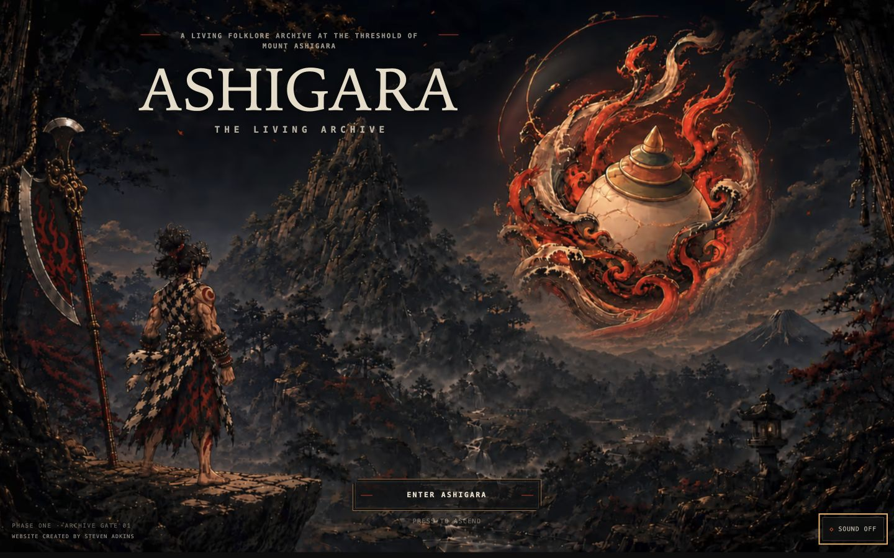
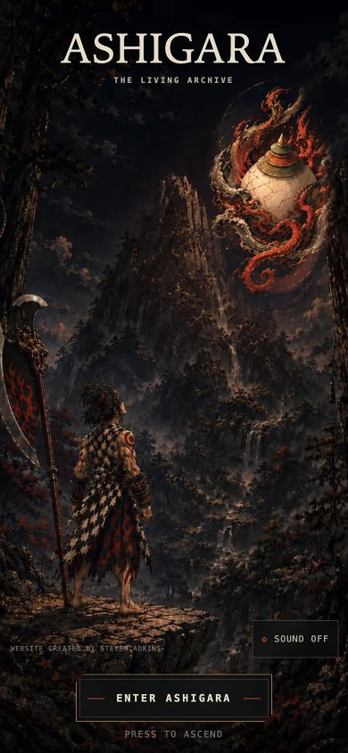
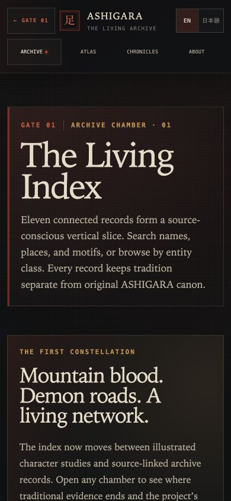
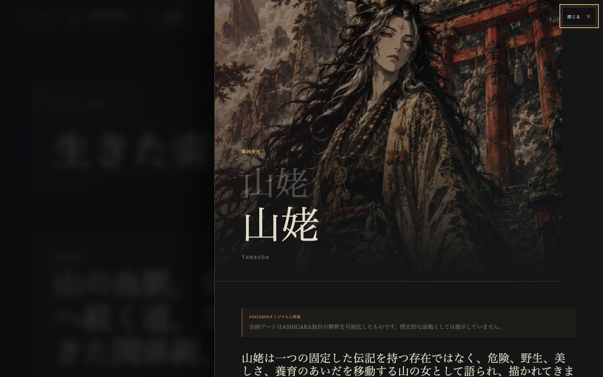
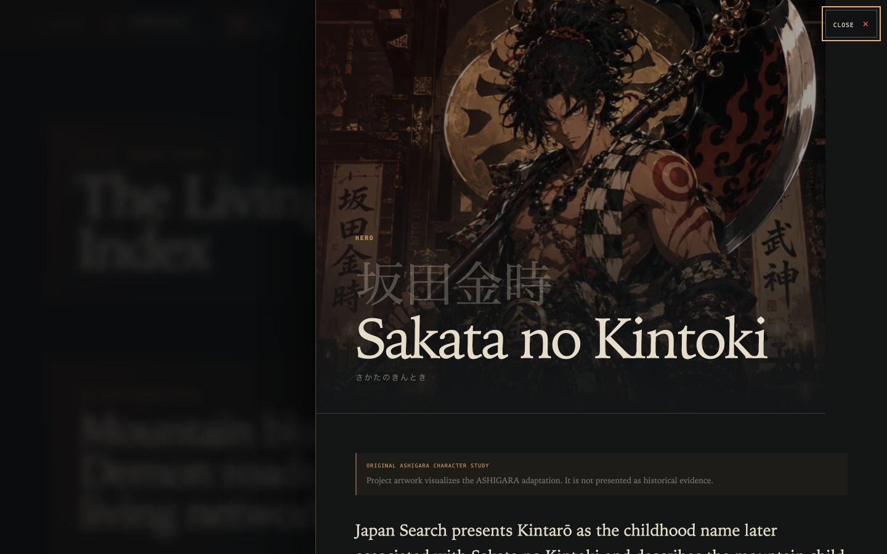
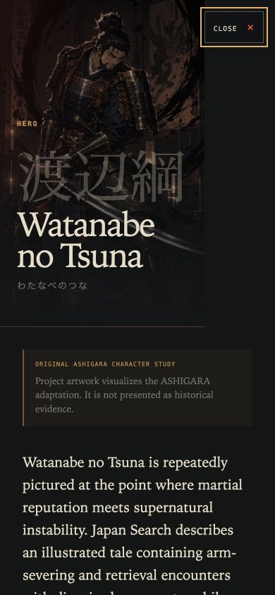

# ASHIGARA — The Living Archive

An interactive, source-conscious folklore archive presented through the title screen of a lost 32-bit Japanese action game.

[`108-Yokai`](https://github.com/trinegod/108-Yokai) is the owner-created repository and planned umbrella collection. **ASHIGARA — The Living Archive** is Gate 01. An isolated, unpublished global-portal interaction study now exists locally; it is not the approved site entrance. Its approved study masters use independent monochrome desktop and mobile compositions, with code-aligned street tags and one functional Gate 01 marker. Later gates remain planned.

> Status: The current Phase One vertical slice contains the expanded illustrated archive and bilingual interface described below. The owner-authorized [public preview](https://ashigara-living-archive.thescale.chatgpt.site) includes the isolated `/portal-lab` study for review while the approved Gate 01 threshold remains the site entrance. Broader device/assistive-technology sign-off, layered production art, Japanese editorial review, and final public license language remain open.

## Screenshots

Real local production-build capture at 1440 × 900:



Real local production-build capture at 390 × 844 using the independent portrait composition:



Real 390 × 844 browser capture of the rebuilt illustrated archive:



Real 1440 × 900 browser capture of the new editorial record chamber:



Real local 1440 × 900 capture of the adult Sakata no Kintoki chamber added in the Raikō-retainer expansion:



Real local 390 × 844 capture of the illustrated Watanabe no Tsuna chamber:



## Creative and product direction

Steven defined the product thesis, ASHIGARA world, approved visual references, permanent-threshold concept, composition locks, interaction sequence, archive intent, and employer-facing case-study goals.

The experience is built around one durable contradiction:

- the world is flat, illustrated, pixel-conscious, restrained, and ancient;
- selected relics and actors break the plane through shallow depth, phase, occlusion, light, and limited motion;
- the archive remains legible, searchable, source-linked, and structurally expandable.

The threshold is Gate 01's permanent signature, not a disposable landing page. New folklore records, citations, places, exhibitions, locales, sprites, and audio can expand behind it without rebuilding the entrance. Future gates can use distinct UX and technical systems without being inserted into ASHIGARA's internal navigation.

## Implemented experience

### Permanent threshold

- Art-directed desktop and 9:16 mobile masters using responsive `<picture>` sources.
- Approved empty-handed Kintarō pose and mobile upward gaze preserved.
- Full-height planted axe retained as a separate stationary interaction mask with a crater pulse.
- Hōju identity preserved as one moving masked relic over a nondestructive actorless clean-plate derivative, with five shallow CSS depth planes, a smooth elliptical sway, controlled internal light, and water/flame/ink phase.
- Pointer, keyboard focus, and touch can awaken the Hōju without blocking the primary entry path or pausing its continuous sway; motion is clamped to the locked composition.
- Kintarō's full figure, legs, feet, and ledge stay planted in a static layer while a small feathered shoulder/upper-torso overlay expands by roughly two percent on a readable breathing loop; no fabricated sprite frames.
- Rare motes, slow mist, tiny pointer parallax, and no continuous camera drift.
- Desktop and mobile use a centered Gate 01, product-title, and archive-subtitle lockup within their independently composed safe areas.
- In Japanese mode, the threshold promotes `足柄` to the primary wordmark and retains `ASHIGARA` as its romanized brand cue.
- `ENTER ASHIGARA` and subordinate `PRESS TO ASCEND` with double-activation prevention and repeat-visit acceleration.
- Optional original 16-bit-inspired impact, rising start strobe, and one-second tail synthesized only after the visitor’s gesture; sound is off by default and remembered locally.
- Axe flash, ground-to-Hōju energy pulse, shoulder response, spatial push, and seamless full-frame fade into the archive. The experimental Kintarō aura is intentionally omitted from the current release.
- Fine-print creator credit on desktop, the upper-left mobile safe area, and internal archive pages, with compact sound controls positioned outside the principal composition.
- The short mobile transition omits the desktop skip control; reduced-motion mode removes idle loops, parallax, mist, and long transitions while preserving entry.

### Living archive

- Internal pages use a dedicated Gate 01 return control and four-route archive navigation without duplicating the threshold as a navigation tab.
- Fourteen source-linked Phase One records across hero, spirit, object, oni, creature, and place types.
- Portrait-led cards and record chambers for Kintarō, Hōju, Yamauba, Shuten-dōji, Ibaraki-dōji, Minamoto no Yorimitsu, Watanabe no Tsuna, Usui Sadamitsu, Urabe no Suetake, and Sakata no Kintoki, with clear notices separating project art from historical evidence.
- Each illustrated chamber uses separate card, desktop-detail, and phone-detail focal positions so faces remain legible without modifying the approved portrait files.
- Search across English, Japanese, kana, romanization, alias, region, theme, motif, and summary fields.
- Entity filter and grid/list views.
- URL-addressable record chambers using `?record=slug`.
- Browser-history behavior, Escape dismissal, modal focus, and focus restoration.
- Visibly separate **Tradition & Sources**, **Variants & Interpretations**, and **ASHIGARA Adaptation** sections.
- Persistent English and provisional Japanese presentation across the threshold, navigation, all five routes, record prose, controls, and accessibility descriptions.

### Atlas, Chronicles, and method

- Responsive illustrated narrative atlas with independent desktop/mobile map masters, coded bilingual place markers, traditional/legendary/approximate certainty labels, and a permanent text alternative.
- One finite eleven-record chronicle with institutional source trail.
- Focused Gate 01 case study covering the creative brief, experience design, visual authorities, actual technology, authorship, AI assistance, implemented work, and current limits.

## Routes

| Route | Purpose | Current state |
|---|---|---|
| `/` | Gate 01 permanent Mount Ashigara threshold | Implemented and browser-tested at desktop and phone sizes |
| `/archive` | Searchable living index and record chamber | Implemented and browser-tested at desktop and phone sizes |
| `/atlas` | Narrative place/region index with list alternative | Implemented and browser-tested at desktop and phone sizes |
| `/chronicles` | Finite curated exhibitions | First chronicle implemented and browser-tested at desktop and phone sizes |
| `/about` | Gate 01 creative direction, system, method, and status | Implemented and browser-tested at desktop and phone sizes |
| `/portal-lab` | Isolated global 108 Yōkai analog-street typography and gate-system study | Published review study using owner-approved art; not linked from the Gate 01 experience or approved as the final collection entrance |

## Architecture

```text
app/
├── page.tsx                    permanent threshold
├── portal-lab/page.tsx         isolated future collection study
├── archive/page.tsx            searchable record index
├── atlas/page.tsx              narrative spatial view
├── chronicles/page.tsx         finite exhibition
├── about/page.tsx              project and method
└── _components/                threshold, shell, navigation, record UI

content/
├── schema.ts                   versioned TypeScript contracts
├── threshold-scene.ts          sprite/depth mode and production-frame backlog
├── records.json                factual records + separate project canon
├── sources.json                institutional source registry
├── places.json                 certainty-labelled atlas nodes
├── chronicles.json             record-based exhibitions
├── assets.json                 machine-readable asset manifest
└── locales/                    English UI + complete provisional Japanese draft layer

source-art/                     untouched canonical source PNGs and JPEGs
derived-art/clean-plates/       versioned AI-assisted actorless working derivatives
public/assets/                  generated AVIF/WebP derivatives
scripts/process-assets.mjs      nondestructive derivative pipeline
tests/                          content, threshold-contract, and SSR checks
docs/                           creative, editorial, performance, decisions
```

The Hōju enhancement uses perspective-aware DOM/CSS compositing rather than a generic Three.js/WebGL object. Its illustrated art, core light, and front/rear wave planes occupy separate shallow transform depths and react to pointer/touch/focus without interrupting the base orbit. An actorless working plate prevents the old static-plus-moving double image while the displayed relic still comes from the locked master. This implements the planned 2.5D behavior while keeping the semantic site independent from a canvas.

## Setup

Requirements: Node.js 22.13+ and npm.

```bash
npm install
npm run dev
```

Open the local URL printed by the development server, normally `http://localhost:3000`.

Production build and preview:

```bash
npm run build
npm run start
```

Validation:

```bash
npm run typecheck
npm run lint
npm run test:content
npm test
npm audit --omit=dev --audit-level=high
```

Regenerate web derivatives without touching the source masters:

```bash
npm run assets:build
```

## Content workflow

1. Add or update a source in `content/sources.json`.
2. Add a versioned record in `content/records.json` with source IDs, uncertainty, variants, relationships, rights, and a distinct ASHIGARA adaptation block.
3. Add place, chronicle, asset, or locale entries through their registries.
4. Run `npm run test:content`; broken cross-references fail.
5. Keep draft records out of the production index until source and editorial review are complete.

The current sample uses institutional pathways from Japan Search / National Diet Library, Tokyo National Museum, The Metropolitan Museum of Art, The British Museum, ColBase, and Ritsumeikan University’s Art Research Center. The bundled site contains links and metadata, not copied museum imagery.

## Asset workflow

The ten owner-supplied PNG and JPEG files are retained byte-for-byte under canonical names in `source-art/`, with SHA-256 hashes documented in [`docs/asset-manifest.md`](docs/asset-manifest.md). AI-assisted actorless clean plates are versioned separately in `derived-art/clean-plates/`; they remove only the baked-in Kintarō/Hōju copies so isolated masked subject layers can be composited over the scene. Runtime AVIF/WebP assets are generated separately at conservative sizes.

The four added archive portraits remain untouched under `source-art/archive/`. Separate 360 and 720-pixel AVIF/WebP versions supply the portrait-led Living Index and detail chambers without modifying the source files.

The current Kintarō and Hōju reference sheets are opaque and not production atlases. Phase One deliberately does not extract or invent final frames from them. A transparent 6–8 frame idle, separate planted-axe/crater matte, and layered Hōju energy planes remain in the asset backlog.

## Accessibility

- Semantic headings, links, buttons, labels, list structures, and source links.
- Skip link and visible keyboard focus.
- Keyboard-operable threshold and archive controls.
- Record-dialog focus entry, Escape dismissal, and trigger focus restoration.
- Search result updates announced with `aria-live`.
- Language controls use pressed-state semantics, persist locally, and update the document language between English and Japanese.
- Map has a complete text/list alternative.
- No audible autoplay; silence is the default complete experience.
- `prefers-reduced-motion` removes decorative motion and camera push.
- No WebGL/GPU dependency; content does not depend on a canvas.
- Generous touch-target minimums and safe-area-aware mobile controls.

A hands-on VoiceOver and cross-browser screen-reader pass is planned before publication; automated/source checks are not presented as a substitute.

## Validation and measured performance

Final automated results:

- TypeScript: passed.
- ESLint: passed with zero warnings/errors.
- Node tests: 13/13 passed.
- Content integrity: 4/4 passed.
- Production build: passed; five routes emitted.
- Production dependency audit: zero vulnerabilities reported.
- Full development/build dependency audit: 11 remaining advisories after non-breaking fixes (1 low, 10 high), all in the Vinext/Vite/Cloudflare toolchain; breaking force-fixes were not applied.

Measured local production artifacts:

| Artifact | Raw | Gzip |
|---|---:|---:|
| Threshold component | 11.7 KB | 3.1 KB |
| Archive index component | 15.2 KB | 4.0 KB |
| Global CSS | 69.3 KB | 13.5 KB |
| Desktop 1440px actorless threshold AVIF | 152.8 KB | — |
| Mobile 941px actorless threshold AVIF | 173.9 KB | — |

These are build/file measurements, not Lighthouse or Core Web Vitals claims. See [`docs/PERFORMANCE_BUDGET.md`](docs/PERFORMANCE_BUDGET.md) and [`docs/VALIDATION.md`](docs/VALIDATION.md) for the complete evidence and remaining checks.

## Current limitations

- The local folder remains `108 YOKAI`; the owner-created GitHub repository is `108-Yokai`.
- A public preview and public source repository now exist. A custom production domain, analytics, CMS, database, and authentication do not.
- No claim is made about users, traffic, conversion, research completeness, or field performance.
- Final source-approved transparent Kintarō/Hōju layers and animation sheets are not supplied; the implemented separation uses versioned clean-plate derivatives plus masked pixels from the locked masters.
- Kintarō uses a restrained still-based treatment, not a claimed production frame animation.
- Ten records now have approved project artwork; records without approved imagery continue to use controlled geometric sigils.
- Japanese is available across all routes as a visibly provisional draft and still awaits fluent editorial review before it can be described as reviewed or authoritative.
- Desktop and 390 × 844 browser acceptance are complete for all routes and the expanded Yamauba chamber; broader phone/tablet hardware coverage remains open.
- Full development-toolchain audit still has 11 advisories requiring coordinated breaking upgrades.

## Roadmap

1. Complete the broader phone/tablet matrix and assistive-technology validation.
2. Approve final public license and artwork credit language.
3. Replace still/composite masks with layered threshold art and approved transparent idle frames.
4. Complete fluent editorial review of the provisional Japanese layer, then expand records in reviewed batches and add production character art.
5. Complete Gate 01's artwork, records, atlas, chronicles, and interactive-scene foundation.
6. Design the separate 108 Yōkai portal hub, then develop Gate 02 as an independent UX case study.
7. Introduce richer atlas relationships and optional future gate collections without claiming a fixed folklore canon.
8. Evaluate an isolated GPU Hōju model only if owner-approved layered/model assets arrive and profiling demonstrates a material visual benefit over the current interactive 2.5D planes.
9. Resolve compatible Sites/Vinext toolchain upgrades, then run Lighthouse/mobile hardware tests.
10. Choose a custom production domain and publication release criteria when the preview is ready to graduate.

## Credits and AI-assistance disclosure

**Creative and product direction:** Steven Adkins  
**Original ASHIGARA concept, world, and supplied visual direction:** Steven / ASHIGARA project  
**Institutional research pathways:** linked individually in the source registry and record chambers

AI-assisted implementation supported frontend engineering, responsive styling, nondestructive actorless clean-plate inpainting, asset optimization, schema/test scaffolding, documentation, provisional localization drafting, and initial structured prose under Steven’s explicit direction and locked-art constraints. Supplied masters remain preserved separately and unchanged. AI output is not treated as a folklore source. Factual archive claims link to external institutional records, and the Japanese draft remains subject to fluent human editorial review.

## Rights and publication

The supplied ASHIGARA artwork is included in the public preview and repository at the project owner's direction. Final public license and credit wording is still pending; preview availability is not a declaration that the source masters have been released under an open-content license.
