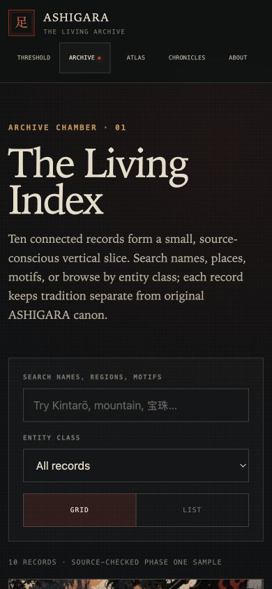
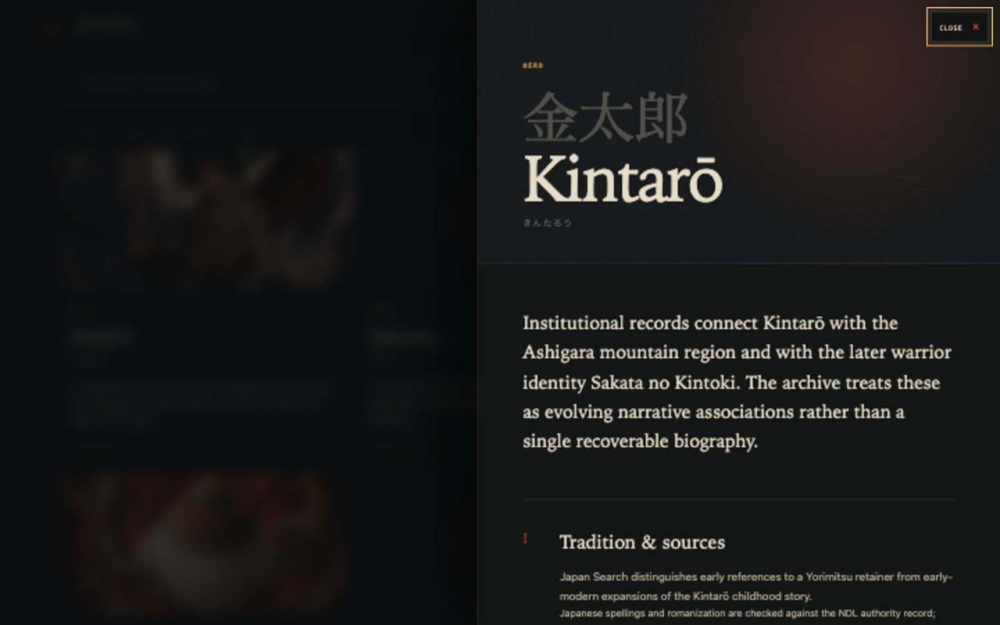

# ASHIGARA — The Living Archive

An interactive, source-conscious folklore archive presented through the title screen of a lost 32-bit Japanese action game.

[`108-Yokai`](https://github.com/trinegod/108-Yokai) is the owner-created repository and future collection identity. The product remains **ASHIGARA — The Living Archive**.

> Status: Phase One vertical slice is live as an owner-authorized [public preview](https://ashigara-living-archive.thescale.chatgpt.site). Broader device/assistive-technology sign-off, layered production art, Japanese editorial review, and final public license language remain open.

## Screenshots

Real local production-build capture at 1440 × 900:


Real local production-build capture at 390 × 844 using the independent portrait composition:


Real phone acceptance capture of the five-route archive shell:



Real deep-linked archive-record capture at 1440 × 900:



## Creative and product direction

Steven defined the product thesis, ASHIGARA world, approved visual references, permanent-threshold concept, composition locks, interaction sequence, archive intent, and employer-facing case-study goals.

The experience is built around one durable contradiction:

- the world is flat, illustrated, pixel-conscious, restrained, and ancient;
- selected relics and actors break the plane through shallow depth, phase, occlusion, light, and limited motion;
- the archive remains legible, searchable, source-linked, and structurally expandable.

The threshold is a permanent signature, not a disposable landing page. New folklore records, citations, places, exhibitions, locales, sprites, and audio can expand behind it without rebuilding the entrance.

## Implemented experience

### Permanent threshold

- Art-directed desktop and 9:16 mobile masters using responsive `<picture>` sources.
- Approved empty-handed Kintarō pose and mobile upward gaze preserved.
- Full-height planted axe retained as a separate stationary interaction mask with a crater pulse.
- Hōju identity preserved through feathered compositing, five shallow CSS depth planes, irregular hover, controlled internal light, and water/flame/ink phase.
- Pointer, keyboard focus, and touch can awaken the Hōju without blocking the primary entry path; motion is clamped and returns to the locked composition.
- Restrained stepped Kintarō breathing is anchored at his planted feet, with minute chest/shoulder lift and weight shift from the approved still; no bounce and no fabricated sprite frames.
- Rare motes, slow mist, tiny pointer parallax, and no continuous camera drift.
- Desktop title and archive line occupy a centered right-side lockup clear of the axe; the entry command is grouped at the lower center, with a tighter safe-area-aware mobile position.
- `ENTER ASHIGARA` and subordinate `PRESS TO ASCEND` with double-activation prevention and repeat-visit acceleration.
- Optional original 16-bit-inspired impact, rising start strobe, and one-second tail synthesized only after the visitor’s gesture; sound is off by default and remembered locally.
- Kintarō activation aura and embers, axe flash, ground-to-Hōju energy pulse, garment response, spatial push, and seamless full-frame fade into the archive.
- Fine-print creator credit on desktop, mobile, and internal archive pages, with compact sound controls positioned outside the principal composition.
- Reduced-motion mode removes idle loops, parallax, mist, and long transitions while preserving entry.

### Living archive

- Ten source-linked Phase One records across hero, spirit, object, oni, creature, and place types.
- Search across English, Japanese, kana, romanization, alias, region, theme, motif, and summary fields.
- Entity filter and grid/list views.
- URL-addressable record chambers using `?record=slug`.
- Browser-history behavior, Escape dismissal, modal focus, and focus restoration.
- Visibly separate **Tradition & Sources**, **Variants & Interpretations**, and **ASHIGARA Adaptation** sections.

### Atlas, Chronicles, and method

- Narrative atlas with traditional/legendary/approximate certainty labels and a permanent text alternative.
- One finite six-record chronicle with institutional source trail.
- About/method route covering art locks, editorial posture, rights status, authorship, AI assistance, and current limits.

## Routes

| Route | Purpose | Current state |
|---|---|---|
| `/` | Permanent Mount Ashigara threshold | Implemented and browser-tested at desktop and phone sizes |
| `/archive` | Searchable living index and record chamber | Implemented and browser-tested at desktop and phone sizes |
| `/atlas` | Narrative place/region index with list alternative | Implemented; server-render tested |
| `/chronicles` | Finite curated exhibitions | First chronicle implemented; server-render tested |
| `/about` | Project, method, sources, rights, and status | Implemented; server-render tested |

## Architecture

```text
app/
├── page.tsx                    permanent threshold
├── archive/page.tsx            searchable record index
├── atlas/page.tsx              narrative spatial view
├── chronicles/page.tsx         finite exhibition
├── about/page.tsx              project and method
└── _components/                threshold, shell, navigation, record UI

content/
├── schema.ts                   versioned TypeScript contracts
├── threshold-scene.ts          sprite/depth mode and production-frame backlog
├── records.json                factual records + separate project canon
├── sources.json                institutional source registry
├── places.json                 certainty-labelled atlas nodes
├── chronicles.json             record-based exhibitions
├── assets.json                 machine-readable asset manifest
└── locales/                    English UI + provisional Japanese seam

source-art/                     untouched canonical source PNGs
public/assets/                  generated AVIF/WebP derivatives
scripts/process-assets.mjs      nondestructive derivative pipeline
tests/                          content, threshold-contract, and SSR checks
docs/                           creative, editorial, performance, decisions
```

The Hōju enhancement uses perspective-aware DOM/CSS compositing rather than a generic Three.js/WebGL object. Its illustrated art, core light, and front/rear wave planes occupy separate shallow transform depths and react to pointer/touch/focus. This implements the planned 2.5D behavior while preserving the opaque locked art and keeping the semantic site independent from a canvas.

## Setup

Requirements: Node.js 22.13+ and npm.

```bash
npm install
npm run dev
```

Open the local URL printed by the development server, normally `http://localhost:3000`.

Production build and preview:

```bash
npm run build
npm run start
```

Validation:

```bash
npm run typecheck
npm run lint
npm run test:content
npm test
npm audit --omit=dev --audit-level=high
```

Regenerate web derivatives without touching the source masters:

```bash
npm run assets:build
```

## Content workflow

1. Add or update a source in `content/sources.json`.
2. Add a versioned record in `content/records.json` with source IDs, uncertainty, variants, relationships, rights, and a distinct ASHIGARA adaptation block.
3. Add place, chronicle, asset, or locale entries through their registries.
4. Run `npm run test:content`; broken cross-references fail.
5. Keep draft records out of the production index until source and editorial review are complete.

The current sample uses institutional pathways from Japan Search / National Diet Library, Tokyo National Museum, The Metropolitan Museum of Art, The British Museum, ColBase, and Ritsumeikan University’s Art Research Center. The bundled site contains links and metadata, not copied museum imagery.

## Asset workflow

The six owner-supplied PNG files are retained byte-for-byte under canonical names in `source-art/`, with SHA-256 hashes documented in [`docs/asset-manifest.md`](docs/asset-manifest.md). Runtime assets are separately generated at conservative sizes.

The current Kintarō and Hōju reference sheets are opaque and not production atlases. Phase One deliberately does not extract or invent final frames from them. A transparent 6–8 frame idle, separate planted-axe/crater matte, and layered Hōju energy planes remain in the asset backlog.

## Accessibility

- Semantic headings, links, buttons, labels, list structures, and source links.
- Skip link and visible keyboard focus.
- Keyboard-operable threshold and archive controls.
- Record-dialog focus entry, Escape dismissal, and trigger focus restoration.
- Search result updates announced with `aria-live`.
- Map has a complete text/list alternative.
- No audible autoplay; silence is the default complete experience.
- `prefers-reduced-motion` removes decorative motion and camera push.
- No WebGL/GPU dependency; content does not depend on a canvas.
- Generous touch-target minimums and safe-area-aware mobile controls.

A hands-on VoiceOver and cross-browser screen-reader pass is planned before publication; automated/source checks are not presented as a substitute.

## Validation and measured performance

Final automated results:

- TypeScript: passed.
- ESLint: passed with zero warnings/errors.
- Node tests: 10/10 passed.
- Content integrity: 3/3 passed.
- Production build: passed; five routes emitted.
- Production dependency audit: zero vulnerabilities reported.
- Full development/build dependency audit: 11 remaining advisories after non-breaking fixes (1 low, 10 high), all in the Vinext/Vite/Cloudflare toolchain; breaking force-fixes were not applied.

Measured local production artifacts:

| Artifact | Raw | Gzip |
|---|---:|---:|
| Threshold component | 8.9 KB | 2.9 KB |
| Archive index component | 29.5 KB | 8.7 KB |
| Global CSS | 52.4 KB | 12.3 KB |
| Desktop 1440px threshold AVIF | 152.8 KB | — |
| Mobile 941px threshold AVIF | 173.9 KB | — |

These are build/file measurements, not Lighthouse or Core Web Vitals claims. See [`docs/PERFORMANCE_BUDGET.md`](docs/PERFORMANCE_BUDGET.md) and [`docs/VALIDATION.md`](docs/VALIDATION.md) for the complete evidence and remaining checks.

## Current limitations

- The local folder remains `108 YOKAI`; the owner-created GitHub repository is `108-Yokai`.
- A public preview and public source repository now exist. A custom production domain, analytics, CMS, database, and authentication do not.
- No claim is made about users, traffic, conversion, research completeness, or field performance.
- True separated threshold layers and final Kintarō/Hōju animation sheets are not supplied.
- Kintarō uses a restrained still-based treatment, not a claimed production frame animation.
- Record artwork beyond Kintarō/Hōju uses controlled geometric sigils.
- Japanese localization is not exposed as complete and awaits fluent editorial review.
- Desktop and 390 × 844 phone acceptance are complete for the refined threshold and archive header; broader phone/tablet hardware coverage remains open.
- Full development-toolchain audit still has 11 advisories requiring coordinated breaking upgrades.

## Roadmap

1. Complete the broader phone/tablet matrix and assistive-technology validation.
2. Approve final public license and artwork credit language.
3. Replace still/composite masks with layered threshold art and approved transparent idle frames.
4. Expand records in reviewed batches and add production character art.
5. Introduce optional `108 Yōkai` collections and richer atlas relationships.
6. Evaluate an isolated GPU Hōju model only if owner-approved layered/model assets arrive and profiling demonstrates a material visual benefit over the current interactive 2.5D planes.
7. Resolve compatible Sites/Vinext toolchain upgrades, then run Lighthouse/mobile hardware tests.
8. Choose a custom production domain and publication release criteria when the preview is ready to graduate.

## Credits and AI-assistance disclosure

**Creative and product direction:** Steven Adkins  
**Original ASHIGARA concept, world, and supplied visual direction:** Steven / ASHIGARA project  
**Institutional research pathways:** linked individually in the source registry and record chambers

AI-assisted implementation supported frontend engineering, responsive styling, asset optimization, schema/test scaffolding, documentation, and initial structured prose under Steven’s explicit direction and locked-art constraints. AI output is not treated as a folklore source. Factual archive claims link to external institutional records and remain subject to ongoing human editorial review.

## Rights and publication

The supplied ASHIGARA artwork is included in the public preview and repository at the project owner's direction. Final public license and credit wording is still pending; preview availability is not a declaration that the source masters have been released under an open-content license.
